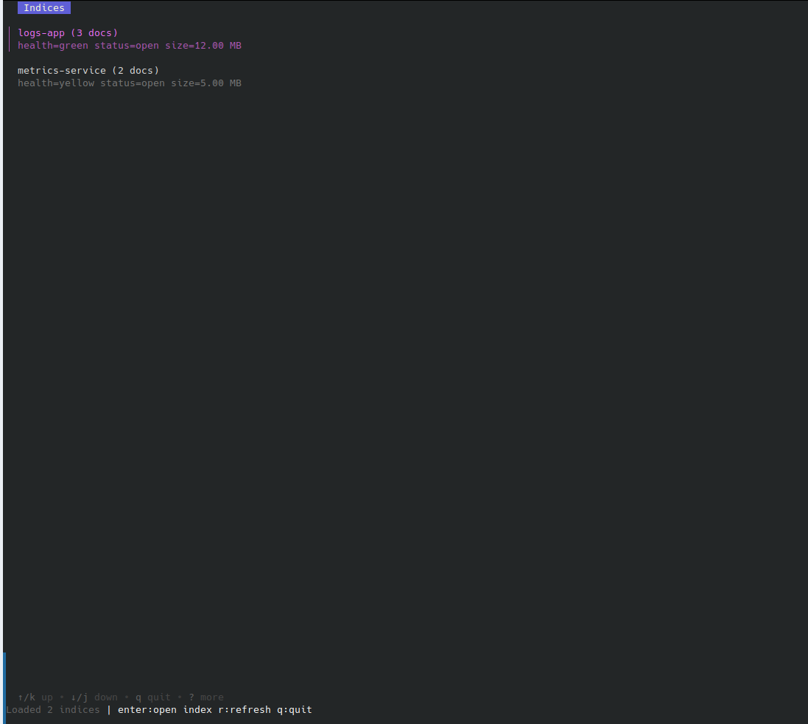

# Elastui

Elastui is a terminal user interface for Elasticsearch written in Go. It provides a compact way to browse indices, inspect documents, and perform a few lightweight management actions without leaving the shell.

## Features

- Discover and inspect indices using `_cat/indices` metadata (health, status, docs count, storage size).
- Browse a page of documents for the selected index and view the `_source` payload.
- Run ad-hoc queries (powered by `query_string`) or fall back to `match_all`.
- Create documents with either custom or auto-generated IDs.
- Delete documents and immediately refresh the index so the UI stays in sync.

## Requirements

- Go 1.24+ (the module uses the Go toolchain auto-upgrade feature).
- Access to an Elasticsearch cluster (8.x recommended).

## Configuration

The client is configured with environment variables:

| Variable | Description | Default |
| --- | --- | --- |
| `ELASTICSEARCH_URL` | Base URL of the cluster | `http://localhost:9200` |
| `ELASTICSEARCH_USERNAME` / `ELASTICSEARCH_PASSWORD` | Basic auth credentials | empty |
| `ELASTICSEARCH_API_KEY` | Optional API key (overrides username/password when set) | empty |

## Usage

```bash
# Compile/run directly
cd /path/to/elastui
go run .

# Or build a binary
go build -o elastui .
./elastui           # start the TUI
./elastui --help    # view CLI and env help

# Install via Go toolchain
go install github.com/olivier/elastui@latest

# Download prebuilt binaries (Linux/macOS/Windows, amd64 & arm64) from GitHub Releases

# Demo mode without a cluster (loads mock indices/documents for screenshots)
./elastui --mock-data
```

Key bindings:

- `enter` – open the selected index (indices view) / view full document (docs view).
- `q` / `ctrl+c` – quit.
- `r` – refresh the current view.
- `/` – set a query for the document list.
- `n` – create a document (step through ID + JSON body inputs).
- `x` – delete the selected document (confirmation required).
- `esc` – go back/cancel forms.

The document creator expects valid JSON. After each create/delete operation the UI automatically issues an index refresh so newly written data is immediately visible.

## Screenshots

### Index list


### Documents list with previews


### Document detail view


### Query syntax

- The search prompt uses Elasticsearch's [`query_string`](https://www.elastic.co/guide/en/elasticsearch/reference/current/query-dsl-query-string-query.html) syntax.
- Leave the field empty for a `match_all` query, or type expressions such as `status:200 AND service:web*`.
- You can combine filters with boolean operators (AND/OR/NOT) and use wildcards/field names like you would in Kibana's Discover UI.

## Notes

- The document view currently fetches the first 20 hits sorted by the natural order returned by Elasticsearch. Pagination can be added later if needed.
- Errors from Elasticsearch are surfaced in the status bar so issues such as authentication failures or invalid JSON bodies are easy to spot.
